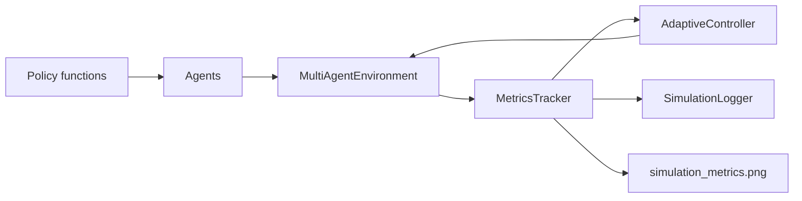

# Adaptive Multi-Agent Simulation Playground

A multi-agent Python simulation where a shared grid environment adapts to collective agent performance, with modular policies, JSONL logging, and metrics visualization.

## What Agent-Based Simulation Means Here

In this project, each agent has its own position, energy level, collected resources, hazard collisions, and policy type. Agents share the same grid environment, so their collective behavior affects the metrics used by the adaptive controller.

The agents are intentionally simple. The focus is on simulation structure, metrics, adaptation events, and clean extensibility rather than complex learned behavior.

## Relevance to Adaptive RL Systems & Simulation Architecture

Adaptive RL and simulation platforms often need multi-agent testbeds where the environment can change in response to collective performance. This project demonstrates that pattern with modular agents, policy hooks, environment dynamics, runtime adaptation, logging, and metrics visualization.

The design is relevant to agent-environment interfaces, adaptive environments, simulation infrastructure, and future RL or meta-learning experiments because policies and adaptation rules are separated from the environment state.

## Features

- Multiple agents sharing one grid environment
- Agent state with position, energy, collected resources, policy type, and status
- Policy types: random, greedy resource seeker, hazard avoider, and energy saver
- Resources, hazards, and safe zones
- Adaptive controller that changes resources, hazards, and safe zones
- Metrics for resources, average energy, active agents, hazard collisions, adaptation events, and episode score
- JSONL simulation logs saved to `outputs/simulation_log.jsonl`
- Metrics plot saved to `outputs/simulation_metrics.png`
- Examples for running, comparing policies, and inspecting adaptation events
- Tests for agent behavior, environment interactions, adaptation, logging, and output generation

## Installation

```bash
pip install -r requirements.txt
```

## Usage

Run the simulation:

```bash
python examples/run_simulation.py
```

Compare policy types:

```bash
python examples/compare_agent_policies.py
```

Inspect adaptation events:

```bash
python examples/inspect_adaptation_events.py
```

Run tests:

```bash
python -m pytest
```

Output files are generated locally and are not tracked in git.
After running, check the `outputs/` directory for plots and logs.

## Quick Demo Output

`examples/run_simulation.py` shows resource collection, active-agent counts, hazard collisions, and adaptation events:

```text
episode=01 resources=08 active=1 energy=6.0 hazards=0 event=reduce_challenge
episode=03 resources=10 active=2 energy=5.0 hazards=2 event=reduce_challenge
episode=05 resources=16 active=3 energy=12.0 hazards=0 event=increase_challenge
```

Policy comparison prints a compact table:

```text
policy          resources  hazards  avg_energy
------------------------------------------------
random                  8        0         0.0
greedy                 55       13         8.2
hazard_avoider          1        0         0.0
energy_saver            6        0         0.0
```

`examples/inspect_adaptation_events.py` prints the adaptation event stream:

```text
episode  action                   reason
----------------------------------------------------------------------
      1  reduce_challenge        active_agents=1, hazard_collisions=0
      5  increase_challenge      resources_collected=16, hazard_collisions=0
```

## Metrics

- `total_resources_collected`: cumulative resources collected by all agents
- `average_agent_energy`: mean remaining energy across agents
- `active_agents`: number of non-exhausted agents
- `hazard_collisions`: cumulative collisions with hazards
- `adaptation_events`: number of runtime environment changes
- `episode_score`: lightweight score combining collection, active agents, and collision penalties

## Architecture



## Repository Status

This repository is a lightweight, research-oriented prototype. It is meant to demonstrate modular simulation infrastructure, adaptive runtime logic, and metric/logging workflows that could be extended into Gymnasium, PettingZoo, or custom RL experiments.

## Future Improvements

- Add a Gymnasium or PettingZoo-style interface
- Add configurable simulation settings through YAML
- Add richer resource spawning and hazard movement rules
- Add learned policies or policy evaluation hooks
- Add animated rendering for debugging multi-agent behavior
